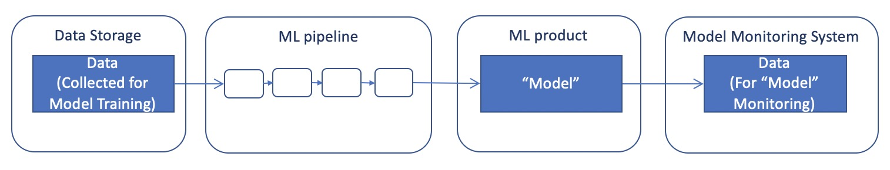
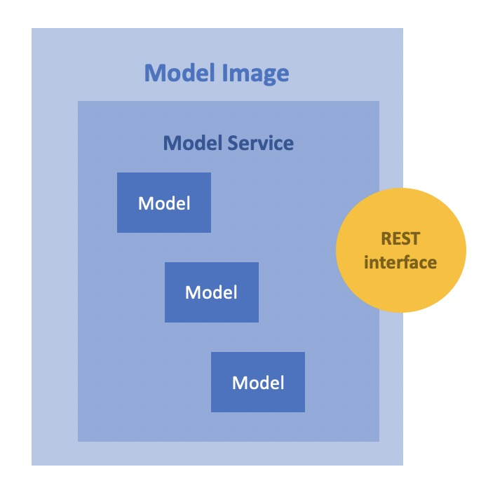

Concepts
#########

ML system, ML Pipeline and Model Monitoring 
*******************************************

ML system, ML Pipeline and Model Monitoring are the central concepts of ML model development and operation. A productive conversation about systematic ML model development is impossible without an understanding of these concepts

**ML system** is a set of components necessary for systematic development and operation of ML models. This is how Google depicts the ML system:

.. image:: google_ml_system.svg

This is how Google explain it: https://cloud.google.com/architecture/mlops-continuous-delivery-and-automation-pipelines-in-machine-learning

This "wow picture" and hardcore article certainly make an impression. But there is one nuance that leads the reader to often bypass Google recommendations and think that they do not applcable to his situation. The nuance is that the complexity of Google articles is many times greater than the perceived complexity of the task at hand, and the resources and competencies required to apply the article are often far beyond the reader's resources and competencies. You will be lucky if the reader of the similar  Google article is a representative of the new emerging MLOps profession. If your company already has an MLOps department, you're probably well past the point and don't need to be told what an ML system and ML pipeline are. But even for you, we recommend continuing reading, as the Synara ML Definitive Guide is an attempt to rethink current ML practices and offer the easiest and cheapest possible approach to developing ML models. The approach is so cheap that it can be used even by the smallest teams engaged in Data Science; for example, consisting of just one Data Scinetist.

**ML Pipeline** is a set of steps that can be used to create a new "model". Usually the steps are implemented as code and run manually by a Data Scientist or automated. Typical ML Pipeline steps include data preparation, model training, model evaluation, validation and serving. The "Model" then enters the ML product and begins to work. To work, the model is given data as input (let's call it X), and the model outputs the result of its work (let's call it Y). In the process, the ML product transmits the monitoring data(X/Y pairs) to the Monitoring System. The monitoring data are used for quality control of the model and for further development of the model.

Very roughly it can be depicted as the follows:

This is still too rough a picture to get to the action, but a good first step for understanding ML systems

How should the Adam-Ivan problem have been solved? Ivan would have to analyze the results of the model monitoring, the ML pipelines code, the data on which the model was trained. Ivan should have had an easy way to reproduce the training of the current model, modify the ML pipelines if necessary, and release a new model trained on the new data

Model Serving, Model, Model Service and Model Image 
************************************

To be precise, the output of a machine learning pipeline is usually not a model, but a **Model Service**. Model Service is a wrapper around one or more models. In the simplest versionData Scientist provides a convenient for ML product interface over the model(s) using Python for preprocessing/postprocessing, json format as inputs and outputs. We will come back to this in more detail later with examples.

The **Model Service** is most often packaged in a docker image with a REST interface and deployed in the ML product as a docker container. This process is called **Model Serving**. Docker image with **Model Service** and REST API packaged inside we will call **Model Image**

ML Product architectures and Model Serving
*****************************************

Above we described how Model Serving works on the example of Microservice ML Product Architecture. Model Serving can be implemented differently depending on the ML product architecture.

There are four types of ML product architectures:

1. **Microservice Arсhitecture**
2. **Batch Inference Architecture**
3. **Embedded Model Arhchitecture** in mobile or edge devices 
4. **Real-time Streaming Architecture**

Examples of such architectures are given below. Using Model Image for Model Serving, with some nuances, is applicable for all kinds of architectures, excluding the Embedded Model architecture. 

Microservice Architecture
=========================
Imagine a web application for a steelworker in a steel plant. The steelmaker during the melting of steel must add special "additives" to achieve optimal steel parameters with minimal additive costs. The model receives information about the melt as input, gives recommendations for the steelmaker from the set of additives, and the ML product displays recommendations for additives on the web interface.

Batch Inference Architecture
============================
TODO
classification of goods by name in cash receipts

We will return to batch inference systems later when we look at ETL processes.

Embedded Model Architecture
===========================
TODO
Face detection in an image while taking a photo

Real-Time Streaming Architecture
================================
TODO
recognition of car numbers in the stream

Why is Model Serving needed?
****************************

A ML model can be created using different libraries and different programming languages. The de facto standard for creating ML models is the Python language now. But each Python library has its own language syntax for representing models and its own file formats for storing these models. Moreover, the programming language of an ML product often differs from Python, and the libraries used by the Data Scientist may change over the life of the Model.

