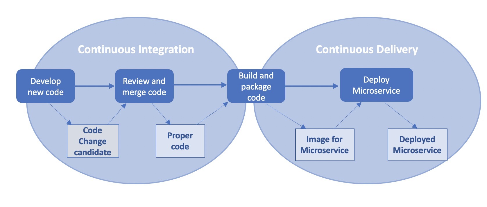

MLOps Concepts
##############

ML system, ML Pipeline and Model Monitoring 
*******************************************

ML system, ML Pipeline and Model Monitoring are the central concepts of ML model development and operation. A productive conversation about systematic ML model development is impossible without an understanding of these concepts

**ML system** is a set of components necessary for systematic development and operation of ML models. This is how Google depicts the ML system:

.. image:: google_ml_system.svg

This is how Google explain it: https://cloud.google.com/architecture/mlops-continuous-delivery-and-automation-pipelines-in-machine-learning

This "wow picture" and hardcore article certainly make an impression. But there is one nuance that leads the reader to often bypass Google recommendations and think that they do not applcable to his situation. The nuance is that the complexity of Google articles is many times greater than the perceived complexity of the task at hand, and the resources and competencies required to apply the article are often far beyond the reader's resources and competencies. You will be lucky if the reader of the similar  Google article is a representative of the new emerging MLOps profession. If your company already has an MLOps department, you're probably well past the point and don't need to be told what an ML system and ML pipeline are. But even for you, we recommend continuing reading, as the Synara ML Definitive Guide is an attempt to rethink current ML practices and offer the easiest and cheapest possible approach to developing ML models. The approach is so cheap that it can be used even by the smallest teams engaged in Data Science; for example, consisting of just one Data Scinetist.

**ML Pipeline** is a set of steps that can be used to create a new "model". Usually the steps are implemented as code and run manually by a Data Scientist or automated. Typical ML Pipeline steps include data preparation, model training, model evaluation, validation and serving. The "Model" then enters the ML product and begins to work. To work, the model is given data as input (let's call it X), and the model outputs the result of its work (let's call it Y). In the process, the ML product transmits the monitoring data(X/Y pairs) to the Monitoring System. The monitoring data are used for quality control of the model and for further development of the model.

Very roughly it can be depicted as the follows:

This is still too rough a picture to get to the action, but a good first step for understanding ML systems

How should the Adam-Ivan problem have been solved? Ivan would have to analyze the results of the model monitoring, the ML pipelines code, the data on which the model was trained. Ivan should have had an easy way to reproduce the training of the current model, modify the ML pipeline if necessary, and release a new model trained on the new data

Model Serving, Model, Model Service and Model Image 
***************************************************

To be precise, the output of a machine learning pipeline is usually not a model, but a **Model Service**. Model Service is a wrapper around one or more models. In the simplest version a Data Scientist provides a convenient for ML product interface over the model(s) using Python for preprocessing/postprocessing, json format as inputs and outputs. We will come back to this in more detail later with examples.

The **Model Service** is most often packaged in a docker image with a REST interface and deployed in the ML product as a docker container. This process is called **Model Serving**. Docker image with **Model Service** and REST API packaged inside we will call **Model Image**

.. image:: model_image.jpeg

ML Product architectures and Model Serving
******************************************

Above we described how Model Serving works on the example of Microservice ML Product Architecture. Model Serving can be implemented differently depending on the ML product architecture.

There are four types of ML product architectures:

1. **Microservice Arсhitecture**
2. **Batch Inference Architecture**
3. **Embedded Model Arhchitecture** for mobile or edge devices 
4. **Real-time Streaming Architecture**

Examples of such architectures are given below. 

ML product with Microservice Architecture is the most widespread and universal. Microservice Architecture uses Model Images for Model Serving. But Model Image is also applicable for all kinds of ML product architectures, excluding maybe the Embedded Model architecture. In some cases, other approaches to Model Serving are applied. For example, dedicated ML engineers can wrap models with java code and deliver Model Service to production as jar files. But, the use of Model Image is the most widely used generic approach, and with a few additions it can even be used for Embedded Models.

So, for our further narration, we will use the example ML product with Microservice Architecture

Microservice Architecture
=========================
A typical ML application with a Microservice Architecture is shown in the picture below.

.. image:: microservice_architecture5.jpeg

For example, let's imagine a web application for a steelworker in a steel plant. The steelmaker during the melting of steel must add special "additives" to achieve optimal steel parameters with minimal additive costs. 

The model receives information about the heat as input (X), gives recommendations for the steelmaker from the set of available additives(Y), and the ML product displays recommendations for additives on the UI. Based on recommendations and experience, the steelmaker makes the actual decision about the additives to be added (Y'). After adding additives to the heat, the ML product receives the resulting information about the heat (X'). Finally, the ML product sends all information about the heat and recommendations (X, X', Y, Y') to the data bus to monitor the performance of the model.

In order not to disrupt the flow of our narrative, we will provide examples for other types of architectures in a separate part of the book, including **Batch Inference Architecture**, **Embedded Model Architecture** for mobile or edge devices, **Real-time Streaming Architecture**. TODO: add references to examples 

ML product dev process and architecture
******************************************************

Software dev process. CI/CD and Dev Infrastructure 
==================================================

Let's assume that Adam and Ivan worked in an organization that uses a modern software development process with CI/CD and microservice architecture. With the right approach, the organization makes microservices as independent from each other and the stateles as possible. Accordingly, the development process of each microservice can be relatively independent and at the top level look something like this:

And the process of developing a typical ML product with a microservice architecture can look like several relatively autonomous processes for developing individual microservices:

So when developing a product, it is necessary not only to create and maintain the code of microservices, but also the code and infratstructure for CI / CD pipelines that deploys and configures these microservices. CI / CD of a real product is much more complicated than the one we have shown in the pictures above. It usually includes autotests of individual microservices, as well as autotests for integrated and system testing, deployment to different environments (dev, test, stage, prod). To work with CI / CD in modern development processes, a development infrastructure is needed: 

1. Source control systems with CI / CD pipelines like GitLab
2. Artefact Repositories like Artifactory (to store microservice images and other packages)
3. Container orchestration like K8S or OpenShift (to deploy and run microservices)
4. Others

Sometimes the CI/CD of a product becomes more complex and confusing than the product's microservices themselves. This is especially true when the CI / CD architecture is not given due importance.

CI/CD looks like an unnecessary high tax on product development. But the paradox is that СI/CD is just necessary to reduce the costs and risks associated with making changes to the product. The TCO (Total Cost of Ownership) of a product mainly depends on the cost of making changes to the product. Therefore, the better and more effective the CI/CD in your product, the lower the TCO (Total Cost of Ownership)

 
Software dev process vs ML dev process
==============================================================================

But let us return to the Adam-Ivan problem. Why is retraining the "model" so expensive? Why does a small change cost as much as doing it all over again?

The answer is well known to any experienced MLOps engineer. Adam didn't have well engineered CI/CD and ML Pipeline for Model Service. Instead of creating a ML pipeline, Adam prepared the data, trained and tested the model manually. Instead of CD for Model Service, Adam sent a set of model files via messenger to ML product developers. To prepare model files, he went through many iterations and experiments. And like any living person, Adam forgot the details of the iteration at which the current version of the model was created.

But why didn't Adam implement a REST interface around the model files and package the result into a microservice? Thus, he could use the typical CI / CD for microservices. The fact is that Adam is a Data Scientist, he does not have the necessary engineering skills. And it seems natural and easy for him to transfer the model files to the developer of the ML product, which is precisely engaged in the development of microservices.

The result is an architectural anti-pattern, one of the common reasons why ML product development becomes a nightmare:

They unite components (backend and model files), which have a significantly different life cycle, development process, development skills, often even different programming languages. Moreover, they need ML pipeline inside CI/CD process of united backend to keep critical information about how the model was generated. The architecture of CI/CD such united backend becomes incredibly complex, and making changes becomes incredibly expensive. To make changes in such backend, we need to roll out a new model; to make changes to the model, we need to roll out a new backend. 

The picture below from Google illustrates how much the ML development process differs from the development process for canonical software. The pcicture depicts CI/CD and ML pipeline needed to develop a single model service ("one model"):

.. image:: google_ml_pipeline_and_cicd.jpeg

We do not urge the reader now to disassemble the details in the Google's picture above. We will dive into the details of the Model Service development process later.

The process of developing a Model Service is many times more complicated than developing a conventional microservice, and comparable in complexity to the process of developing an entire software product. 

So while developing a ML product, we are dealing with two very different and equally complex development processes: Software dev process and ML dev process. We began to describe the difference between these processes from the engineering side. But the essential difference between these processes extends far beyond engineering tasks, in how to specify requirements for models, how to test and operate models. We will touch on these points separately.

ML product twofold dev process = Software dev process + ML dev process
======================================================================
Now we know that when developing a ML product, we are dealing with two development processes: the Software Dev process and the ML Dev process. We must make these processes as independent from each other as possible in order to make the development of the entire ML product manageable. That is why a Model Serving needed and that is why models are developed and packaged into separate components, most often these are microservices (Model Services).

For our ML product with microservice architecture, the correct development process should look something like this:

The picture above is a simplified illustration of a twofold dev process. Inside the ML dev process:

1. Data Scientist develops individual steps of the ML pipeline
2. Then trains the model by running the ML pipeline with different parameters
3. Then deploys the Model Service by running CI/CD pipeline, which pack Model Files into Model Image

Data Engineering Aspect of Twofold Dev Process
==============================================
It would seem that Adam-Ivan the problem is solved now with the help of the twofold process. But the experienced Data Scientist sees that the picture is too good to be true. We lack one important aspect - the data aspect. Working with data is often the most complex and critical element in the development of an ML product. And, unfortunately, we cannot isolate the Data Engineering and manage it separately from the software development and the ML development process.

The Dev Engineering process is an aspect that permeates all elements of ML product and requires the coordinated work of all members of the ML product development team. Moreover, the elements of Data Engineering of ML product extend far beyond the twofold ML product dev process. Schematically, this can be represented as something like this:

This picture is good for understanding, but a poor guide to action. So we will have to dive into the data architecture of the ML product to learn how to manage the Data Engineering process

Data Architecture of ML product
================================

Earlier in article `Microservice Architecture`_ , we considered the Date Flow inside the ML of the product. It's time to consider the complete data architecture of the ML product.

Naive Data Architecture of ML product
-------------------------------------

Let's take a look at the naive architecture of an ML product: 

It has obvious problems, and needs significant additions. It can even work if you are focused exclusively on the long-term development of a single ML product and you have an abundance of human and time resources.

But more often in ML development for non-IT companies, you have to deal with a large number of ML products and serious resource constraints at the same time. Let's formulate the main problems of naive ML product architecture:

1. You are not given direct access to request data from the SCADA system. Direct access poses risks to the security and continuity of production systems
2. It is necessary to accumulate data directly from the SCADA system in order to create the first model (even before creating an ML product)
3. Accumulation of historical data in the main DB leads to a rapid degradation of performance. Need a separate DB
4. Maintaining a separate DB (similar to the main DB) for historical data is expensive and does not scale well. In practice, this usually results in historical data being deleted.

Complete Data Architecture of ML product 
----------------------------------------
The architecture below solves these four problems of naive architecture:
TODO: how solves?

But the complexity and cost of such an ML product increases many times over. Specialists from non-ML areas “feel” excessive complexity and try to save money by trying to get rid of the required ingredients:

- Data Bus
- Long-term Storage
- ML pipeline and monitoring system

As practice shows, the consequences of such savings are sad. They do not simply increase the cost of development even more than with a systems approach. Such ML products often  “do not survive”, dying almost immediately as the implementation project “ends”. Quote from `Google <https://cloud.google.com/architecture/mlops-continuous-delivery-and-automation-pipelines-in-machine-learning>`_ *"the real challenge isn't building an ML model, the challenge is building an integrated ML system and to continuously operate it in production"*.

From ML Product to MLOps Platform
***************************************

Three ways to harness ML
=========================
What to do in a situation of high cost of developing ML products? Here we have three options:

1. Accept the high cost of products and continue
2. Refuse to develop ML products due to unprofitability
3. Save money without giving up essential elements of ML product development

The first option is suitable if you have found a highly profitable product that pays off despite high costs. This is typical for IT companies, where ML is the core business. For non-IT companies, such projects are good candidates for outsource. An outsourcer can significantly increase the profitability of a product by selling it to several clients. In the case of outsourcing a single project, you probably do not need to understand the specifics of developing ML products.

The second option is often good for medium and small non-IT companies. At the same time, you do not refuse to use AI or ML. You abandon your own development and focus on using ready-made solutions out of the box, or with minimal modification.

Our story is aimed at those who chose the third option. Although in reality the third option does not exist in its pure form. More often we encounter mixed cases when the third option is combined with the second and even the first.

Three Platforms for ML Product development
==========================================
Before you move forward, you need to be clear about your goals. In fact, when deciding to develop ML products, you are not just deciding to acquire new ML products because it is on hype. You decide to gain the ability to develop ML products. That is, the key value you are going for is not the availability of ML products here and now, but the competence to create its where and when needed. If you are not ready for this, it might be a worthless venture.

How can we save on developing ML products? The general answer is banal: we need the right tools, standards and skills. But as always, the devil is in the details.

To start diving into these details, we will break down the architecture of our ML product into three large parts:

1. Software Engineering
2. Data Engineering
3. ML Engineering

Technically, all three of these areas overlap greatly, but the industry is evolving in such a way that engineering dev competencies, tools and process in companies are crystallizing separately around these areas.

Essentially, the cost of developing and operating ML products is the cost of tools, processes and competencies. From now on we will call a platform a set of tools, processes and competences in each of the three engineering areas. So we will talk about three platforms:

MLOps
*****
TODO:

