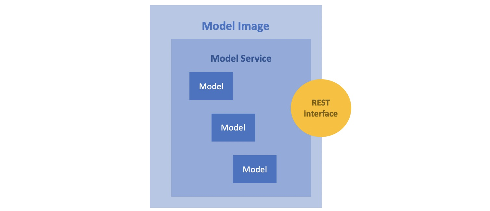

Concepts
#########

ML system, ML Pipeline and Model Monitoring 
*******************************************

ML system, ML Pipeline and Model Monitoring are the central concepts of ML model development and operation. A productive conversation about systematic ML model development is impossible without an understanding of these concepts

**ML system** is a set of components necessary for systematic development and operation of ML models. This is how Google depicts the ML system:

.. image:: google_ml_system.svg

This is how Google explain it: https://cloud.google.com/architecture/mlops-continuous-delivery-and-automation-pipelines-in-machine-learning

This "wow picture" and hardcore article certainly make an impression. But there is one nuance that leads the reader to often bypass Google recommendations and think that they do not applcable to his situation. The nuance is that the complexity of Google articles is many times greater than the perceived complexity of the task at hand, and the resources and competencies required to apply the article are often far beyond the reader's resources and competencies. You will be lucky if the reader of the similar  Google article is a representative of the new emerging MLOps profession. If your company already has an MLOps department, you're probably well past the point and don't need to be told what an ML system and ML pipeline are. But even for you, we recommend continuing reading, as the Synara ML Definitive Guide is an attempt to rethink current ML practices and offer the easiest and cheapest possible approach to developing ML models. The approach is so cheap that it can be used even by the smallest teams engaged in Data Science; for example, consisting of just one Data Scinetist.

**ML Pipeline** is a set of steps that can be used to create a new "model". Usually the steps are implemented as code and run manually by a Data Scientist or automated. Typical ML Pipeline steps include data preparation, model training, model evaluation, validation and serving. The "Model" then enters the ML product and begins to work. To work, the model is given data as input (let's call it X), and the model outputs the result of its work (let's call it Y). In the process, the ML product transmits the monitoring data(X/Y pairs) to the Monitoring System. The monitoring data are used for quality control of the model and for further development of the model.

Very roughly it can be depicted as the follows:

.. image:: sinara_ml_system-01.jpeg

This is still too rough a picture to get to the action, but a good first step for understanding ML systems

How should the Adam-Ivan problem have been solved? Ivan would have to analyze the results of the model monitoring, the ML pipelines code, the data on which the model was trained. Ivan should have had an easy way to reproduce the training of the current model, modify the ML pipeline if necessary, and release a new model trained on the new data

Model Serving, Model, Model Service and Model Image 
************************************

To be precise, the output of a machine learning pipeline is usually not a model, but a **Model Service**. Model Service is a wrapper around one or more models. In the simplest version a Data Scientist provides a convenient for ML product interface over the model(s) using Python for preprocessing/postprocessing, json format as inputs and outputs. We will come back to this in more detail later with examples.

The **Model Service** is most often packaged in a docker image with a REST interface and deployed in the ML product as a docker container. This process is called **Model Serving**. Docker image with **Model Service** and REST API packaged inside we will call **Model Image**

ML Product architectures and Model Serving
*****************************************

Above we described how Model Serving works on the example of Microservice ML Product Architecture. Model Serving can be implemented differently depending on the ML product architecture.

There are four types of ML product architectures:

1. **Microservice Arсhitecture**
2. **Batch Inference Architecture**
3. **Embedded Model Arhchitecture** for mobile or edge devices 
4. **Real-time Streaming Architecture**

Examples of such architectures are given below. 

ML product with Microservice Architecture is the most widespread and universal. Microservice Architecture uses Model Images for Model Serving. But Model Image is also applicable for all kinds of ML product architectures, excluding maybe the Embedded Model architecture. In some cases, other approaches to Model Serving are applied. For example, dedicated ML engineers can wrap models with java code and deliver Model Service to production as jar files. But, the use of Model Image is the most widely used generic approach, and with a few additions it can even be used for Embedded Models.

So, for our further narration, we will use the example ML product with Microservice Architecture

Microservice Architecture
=========================
A typical ML application with a Microservice Architecture is shown in the picture below.

For example, let's imagine a web application for a steelworker in a steel plant. The steelmaker during the melting of steel must add special "additives" to achieve optimal steel parameters with minimal additive costs. 

The model receives information about the heat as input (X), gives recommendations for the steelmaker from the set of available additives(Y), and the ML product displays recommendations for additives on the UI. Based on recommendations and experience, the steelmaker makes the actual decision about the additives to be added (Y'). After adding additives to the heat, the ML product receives the resulting information about the heat (X'). Finally, the ML product sends all information about the heat and recommendations (X, X', Y, Y') to the data bus to monitor the performance of the model.

Batch Inference Architecture
============================
TODO
classification of goods by name in cash receipts

We will return to batch inference systems later when we look at ETL processes.

Embedded Model Architecture
===========================
TODO
Face detection in an image while taking a photo

Real-Time Streaming Architecture
================================
TODO
recognition of car numbers in the stream

ML product. Twofold development process
***************************************

Software dev process. CI/CD and Dev Infrastructure 
==================================================

Let's assume that Adam and Ivan worked in an organization that uses a modern software development process with CI/CD and microservice architecture. With the right approach, the organization makes microservices as independent from each other and the stateles as possible. Accordingly, the development process of each microservice can be relatively independent and at the top level look something like this:

.. image:: microservice_dev_process.jpeg

And the process of developing a typical ML product with a microservice architecture can look like several relatively autonomous processes for developing individual microservices:

So when developing a product, it is necessary not only to create and maintain the code of microservices, but also the code and infratstructure for CI / CD pipelines that deploys and configures these microservices. CI / CD of a real product is much more complicated than the one we have shown in the pictures above. It usually includes autotests of individual microservices, as well as autotests for integrated and system testing, deployment to different environments (dev, test, stage, prod). To work with CI / CD in modern development processes, a development infrastructure is needed: 

1. Source control systems with CI / CD pipelines like GitLab
2. Artefact Repositories like Artifactory (to store microservice images and other packages)
3. Container orchestration like K8S or OpenShift (to deploy and run microservices)
4. Others

Sometimes the CI/CD of a product becomes more complex and confusing than the product's microservices themselves. This is especially true when the CI / CD architecture is not given due importance.

CI/CD looks like an unnecessary high tax on product development. But the paradox is that СI/CD is just necessary to reduce the costs and risks associated with making changes to the product. The TCO (Total Cost of Ownership) of a product mainly depends on the cost of making changes to the product. Therefore, the better and more effective the CI/CD in your product, the lower the TCO (Total Cost of Ownership)

ML dev process. ML Pipeline and ML infrastructure
=================================================

But let us return to the Adam-Ivan problem. Why is retraining the "model" so expensive? Why does a small change cost as much as doing it all over again?

The answer is obvious. Adam didn't have well engineered CI/CD and ML Pipeline for Model Service.
 Traditional CI/CD is not enough to enable cheap iterative changes in the Model Service. 

More is needed, including:

1. СI/CD
2. Data Handling
3. ML pipelines
4. More Computing Power

The process of developing a Model Service is many times more complicated than developing a conventional microservice, comparable in complexity to the process of developing an entire ML product. 

This is how Google depicts CI/CD and ML pipeline needed to develop a single model service ("one model"):

We do not urge the reader now to disassemble the details in the Google's picture above. We will dive into the details of the Model Service development process later.

For now, our main goal is to illustrate that when developing a ML product, we are dealing with two very different and equally complex development processes. And this is true even if we develop and operate only one ML model for a ML product.

